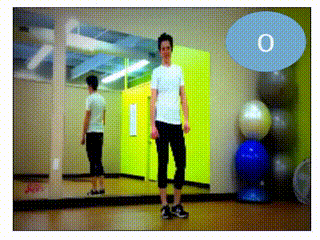
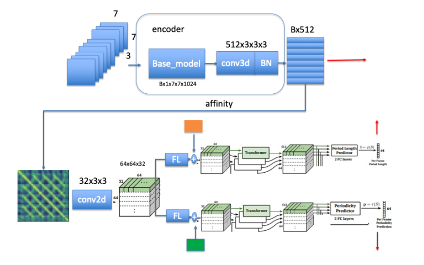

# RepNet
This repo is not offical implementation, re-arranging source code from repnet colab. And develop to human excise **repetition counter** applacation.





## NETWORK



### Checkpoint

```python
https://storage.googleapis.com/repnet_ckpt/checkpoint
https://storage.googleapis.com/repnet_ckpt/ckpt-88.data-00000-of-00002
https://storage.googleapis.com/repnet_ckpt/ckpt-88.data-00001-of-00002
https://storage.googleapis.com/repnet_ckpt/ckpt-88.index
```

### Installation
install ffmpg (conda install ffmpeg or other method)

```
pip install -r requirement.txt
```


### Usage

```shell
cd main && python demo.py -c weights/ -v ../data/test.mp4
```


### WORKFLOW

- [x] repnet inference demo
- [ ] Training repnet
- [ ] human pose feature affinity matrix input
- [ ] online counter 


### Contrbute

- [repnet_colab.ipynb](https://colab.research.google.com/github/google-research/google-research/blob/master/repnet/repnet_colab.ipynb#scrollTo=FUg2vSYhmsT0)

- [RepNet project page.](https://sites.google.com/view/repnet)
